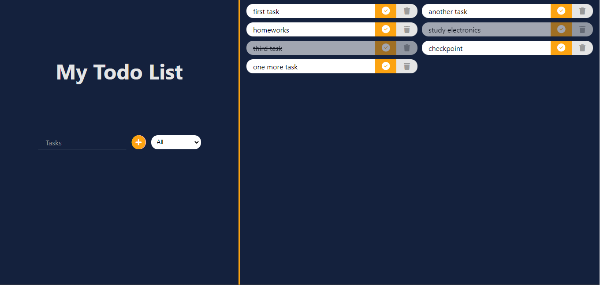

# TodoApp

This is an aplication where you can add or delete tasks.

It uses local storage to save the tasks, so you can close the browser and the tasks will be saved!

 

 

## How to use

Open the link to open de app in your browser: [TodoApp](https://nlarrea.github.io/todo-app/)

Then, write the task you want to add in the input and click the button next to it to add the task to the list. Once you do it, you will be able to see it on the right side of the screen. You can add as many tasks as you want!

If you want to delete a task, just click the button next to it and it will be deleted from the list.

Otherwise, you can click the check button next to the task to mark it as completed. If you want to unmark it, just click the button again.

 

Use the select input to filter the tasks by status. You can choose between all, completed and uncompleted tasks.

 

 

## Purpose

This project was made to practice JavaScript and DOM manipulation. You can see the code in this repository and use it as you want!

Feel free to give me any feedback or suggestion to improve the app!

 

 

## Contact

If you have any doubt or suggestion about the content of this document or any other matter, **don't hesitate to contact me** from any of these links!

 &emsp;
 &emsp;

